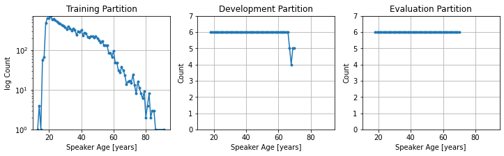

# FishBoardMix corpus for Speaker Age Estimation

##### Table of Contents  
* [About](#about)  
* [Requirements](#requirements)  
* [Getting Started with FishBoardMix](#getting-started)
  * [Step by Step Example](#step-by-step-example)
* [Related Corpora](#related-corpora-for-speaker-age-estimation)
  * [VoxCeleb](#voxceleb)
  * [SRE08/10](#sre0810)

-------

## About

The FishBoardMix corpus is designed to explore Speaker-Age estimation technology.
Motivated by the improvements brought by the team behind the [Age-VoxCeleb](#voxceleb) project, FishBoardMix includes a large number of speakers with a relatively balanced age/gender coverage.
It combines audio and meta-data from 3 popular LDC corpora: Fisher, Mix6 and Switchboard; where participants have provided their gender and age.

Despite data preparation being a time consuming and tedious task, it is essential for the reproducibility of experimental research.
This project contains the scripts necessary to assemble the FishBoardMix corpus from original copies of LDC corpora, publicly available from [LDC portal](https://www.ldc.upenn.edu/).


\  | FSH | SWB | MIX6 | Tot
--- | --- | --- | --- | ---
\# Speakers (f, m) | 11606 (6712, 4894) | 2631 (1431, 1200) | 589 (300, 289) | 14826 (8443, 6383)
Recordings | 22320 | 28012 | 8776 | 59108

The FishBoardMix corpus consists of 59k recordings from 14.8k age-labeled speakers, 8.4k female and 6.4k male. 
These recordings are 249 seconds long on average.


[↑top](#fishboardmix-corpus-for-speaker-age-estimation)


### Known caveats and work-arounds

Call recordings from the Fisher corpus were initiated by an automated dial-up platform, therefore the identity of speakers who answered these calls may or may not match the subjects who actually registered with LDC. 
In order to mitigate this inconsistency, FishBoardMix makes use of the _manual audit files_ included in Fisher to discard any subject with conflicting meta-data.


[↑top](#fishboardmix-corpus-for-speaker-age-estimation)


## Requirements
Corpus | LDC Catalog No.
--- | ---
Fisher | [LDC2004T19](https://catalog.ldc.upenn.edu/LDC2004T19),[LDC2004S13](https://catalog.ldc.upenn.edu/LDC2004S13),[LDC2005T19](https://catalog.ldc.upenn.edu/LDC2005T19),[LDC2005S13](https://catalog.ldc.upenn.edu/LDC2005S13).
Switchboard | [LDC98S75](https://catalog.ldc.upenn.edu/LDC98S75),[LDC99S79](https://catalog.ldc.upenn.edu/LDC99S79),[LDC2002S06](https://catalog.ldc.upenn.edu/LDC2002S06),[LDC2001S13](https://catalog.ldc.upenn.edu/LDC2001S13),[LDC2004S07](https://catalog.ldc.upenn.edu/LDC2004S07).
MIX6 | [LDC2013S03](https://catalog.ldc.upenn.edu/LDC2013S03).

Must download, unpack and place (a symlink to) these folders in one directory.

[↑top](#fishboardmix-corpus-for-speaker-age-estimation)

----------
## Getting Started

The goal of this data preparation task is to create 5 list-files with information relevant to conduct experiments for Speaker-Age estimation.
There are three steps:

1. Process each individual corpus creating 5 list: `spk2gender`, `utt2yage`, `utt2spk`, `spk2yage`, `wav.scp`.
2. Aggregate the list files.
3. Partition into Train, Eval and Dev randomly ensuring speakers do not overlap across set.


[↑top](#fishboardmix-corpus-for-speaker-age-estimation)


### Step by Step Example

#### 1. Process each individual corpus.
Individually go to `FishBoardMix/staging/SWB`, `FishBoardMix/staging/FSH` and `FishBoardMix/staging/MIX6`, and run the `build.sh` scripts included.

Run the `build.sh` script without arguments to see the help message:
```
% cd FishBoardMix/staging/SWB
% ./build.sh 
USAGE:
 ./build.sh <LDC_DIR>
;;; where LDC_DIR contains LDC98S75 LDC99S79 LDC2002S06 LDC2001S13 LDC2004S07.

% $ ls -ld /path/to/LDC/swb/*
/path/to/LDC/swb/LDC98S75
/path/to/LDC/swb/LDC99S79
/path/to/LDC/swb/LDC2002S06
/path/to/LDC/swb/LDC2001S13
/path/to/LDC/swb/LDC2004S07

% ./build.sh /path/to/LDC/swb
[INFO] Done. Output: spk2gender utt2yage utt2spk spk2yage wav.scp
%
```

```
% cd FishBoardMix/staging/FSH
% ./build.sh 
USAGE:
 ./build.sh <LDC_DIR>
;;; where LDC_DIR contains LDC200{4,5}T19 and LDC200{4,5}S13.

% $ ls -ld /path/to/LDC/fsh/*
/path/to/LDC/fsh/LDC2004T19
/path/to/LDC/fsh/LDC2005T19
/path/to/LDC/fsh/LDC2004S13
/path/to/LDC/fsh/LDC2005S13


% ./build.sh /path/to/LDC/fsh
[INFO] LDC_DIR: /path/to/LDC/fsh
[INFO] Fisher pindata.tbl: /path/to/LDC/fsh/LDC2004T19/fe_03_p1_tran/doc/fe_03_pindata.tbl
[INFO] Fisher pindata.tbl: /path/to/LDC/fsh/LDC2005T19/fe_03_p2_tran/doc/fe_03_pindata.tbl
[INFO]     spk2yage    (1/5) [done]
[INFO]     spk2gender  (2/5) [done]
[INFO]     utt2spk     (3/5) [done]
[INFO]     utt2yage    (4/5) [done]
[INFO]     wav.scp     (5/5) [done]
[INFO] Done. Output: spk2gender utt2yage utt2spk spk2yage wav.scp
%
```


```
% cd FishBoardMix/staging/MIX6
% ./build.sh 
USAGE:
 ./build.sh <LDC_DIR>
;;; where LDC_DIR contains LDC2013S03.

% $ ls -ld /path/to/LDC/mix/*
/path/to/LDC/mix/LDC2013S03

% ./build.sh /path/to/LDC/mix/
[INFO] Done. Output: spk2gender utt2yage utt2spk spk2yage wav.scp
%
```

[↑top](#fishboardmix-corpus-for-speaker-age-estimation)

#### 2. Aggregate.

Consolidate the list files:

```
% cd FishBoardMix/staging/
% ./build.sh
FSH/spk2gender	MIX6/spk2gender  SWB/spk2gender
FSH/spk2yage  MIX6/spk2yage  SWB/spk2yage
FSH/utt2yage  MIX6/utt2yage  SWB/utt2yage
FSH/utt2spk  MIX6/utt2spk  SWB/utt2spk
FSH/wav.scp  MIX6/wav.scp  SWB/wav.scp
   14826 spk2gender
   14826 spk2yage
   59108 utt2yage
   59108 utt2spk
   59108 wav.scp
  206976 total
done!.
```
[↑top](#fishboardmix-corpus-for-speaker-age-estimation)


#### 3. Partition.

Since there is no single "correct" way to split the data, FishBoardMix supports multiple versions of the partitioning scheme.
The default (and currently only) parition is `v18to70-2203`, however, the scripts that generate this parition can be easily adjusted to create custom ones.

```
% cd FishBoardMix/v18to70-2203/
% ./build.sh ../staging/

   14195 train/spk2gender
   14195 train/spk2yage
   53798 train/utt2spk
   53798 train/utt2yage
   53798 train/wav.scp
  189784 total
7dd98136c912029402815eb66b64456d  train/spk2gender
b745b4165e5662cca69f4631f90ff086  train/spk2yage
eef3a2f1fb962fb8b8275199bc99520e  train/utt2spk
3fdff70ae9c6efbf64167084cf85473d  train/utt2yage
205b8316cafb4ac49bb858a02e399d4c  train/wav.scp

   318 eval/spk2gender
   318 eval/spk2yage
  2726 eval/utt2spk
  2726 eval/utt2yage
  2726 eval/wav.scp
  8814 total
3a041d779503c2e4ac2e2c667d834636  eval/spk2gender
aed7cfffc862e31a10a575ece5e06be2  eval/spk2yage
e7b2eed734cd0ce168b864d3c422d698  eval/utt2spk
255e7cbb67af0bc9801a96c50ae6ede0  eval/utt2yage
ca6a61807ff76455b15702c11f7e7cb2  eval/wav.scp

   313 dev/spk2gender
   313 dev/spk2yage
  2584 dev/utt2spk
  2584 dev/utt2yage
  2584 dev/wav.scp
  8378 total
59310968c27c34f5cb3de97ed3a7bb6b  dev/spk2gender
c80d6ccef0746c1247c341621fb95b02  dev/spk2yage
352c4487d5cd0d753e2dd9fa17c6223b  dev/utt2spk
1f9e06b73f27aec53a57892ccda64c93  dev/utt2yage
ee04be5cd9d4cb6144027e1affc6b8e3  dev/wav.scp

done!
%

```


##### Number of speakers by age.




[↑top](#fishboardmix-corpus-for-speaker-age-estimation)

----------
# Related corpora for Speaker Age Estimation

## VoxCeleb

### Age-VOX-Celeb
With nearly 5k speakers and 168k clips from 22k videos, Age-VOX-Celeb is the largest _freely available_ corpus labeled for age estimation. The age labels were obtained from multiple data sources.
* GITHUB Repository: [AgeVoxCeleb](https://github.com/nttcslab-sp/agevoxceleb)
* Article: [Age-VOX-Celeb: Multi-Modal Corpus for Facial and Speech Estimation. Tawara et al.](https://ieeexplore.ieee.org/abstract/document/9414272)

### VoxCeleb Enrichment for Age and Gender Recognition
This is a closely related corpus independently done that automates the annotation of age labels more liberally than [Age-VOX-Celeb](#age-vox-celeb).
* GITHUB Repository: [VoxCelebEnrichment](https://github.com/hechmik/voxceleb_enrichment_age_gender)
* Article: [VoxCeleb Enrichment for Age and Gender Recognition. Hechmi, et al.](https://arxiv.org/abs/2109.13510)

## SRE08/10
This corpus has been used in recent years, however, its small number of speakers (1658) and unbalanced distribution across age groups renders it for limited use.
Refer to Table 1 in [this article](https://ieeexplore.ieee.org/abstract/document/9414272) for an enlightening review of corpora available for research on age estimation.

[↑top](#fishboardmix-corpus-for-speaker-age-estimation)
